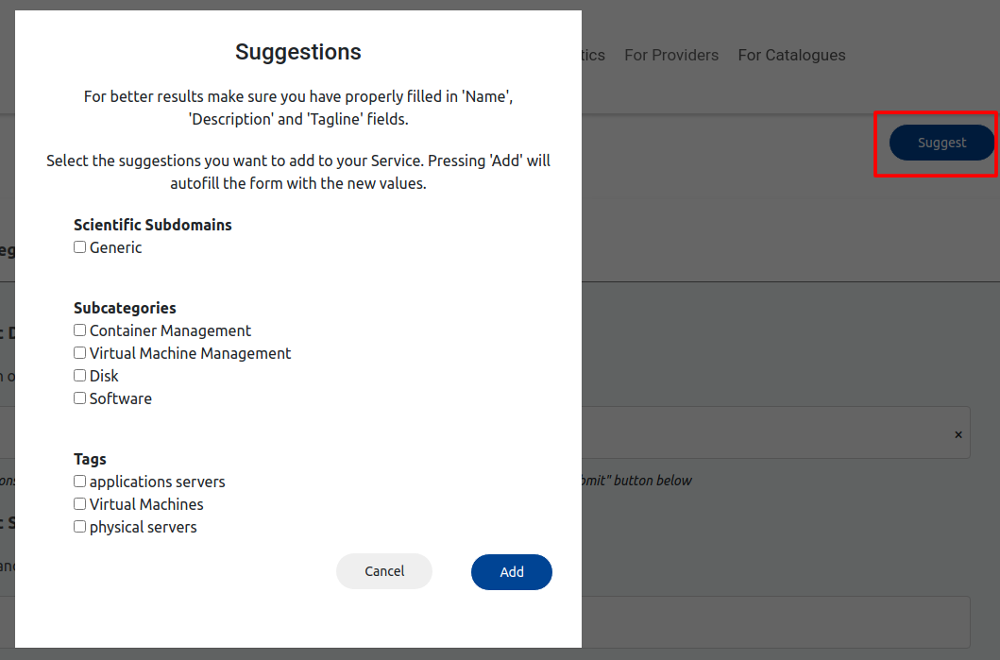

# Licence

<! --- SPDX-License-Identifier: CC-BY-4.0  -- >

## Introduction

The Autocompletion service has the goal of generating autocompletion suggestions for categorical attributes of an onboarding service. To perform the autocompletion uses the text attributes of the service (i.e. tagline, description) that have already been filled.

Specifically the service currently suggests:

- Scientific subdomains
- Subcategories
- Tags

The application is built as a microservice with a REST API that is deployed in the porviders infrastructure (from Athena).

## API

[Autocompletion API](https://app.swaggerhub.com/apis-docs/MikeXydas/Providers-Autocompletion/1.1.2)
